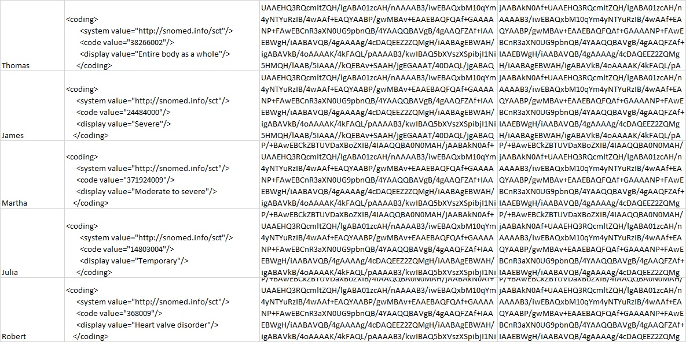

# Selective Access to Clinical Data - example

This repository demonstrates the main advantages of the Attribute Base Encryption schemes is the ability they provide to manage who access a set of data. Towards this end, we make use of a modified version of the [GoFE](https://github.com/fentec-project/gofe) functional encryption (FE) library. Particularly, cryptographic material required by this approach is now serialized and stored in different files, which are used to fulfill the functionality of the ABE algorithms. Furthermore, we follow the typical functional encryption setup with a central authority as key generator, a client who possesses data and encrypts it, and a user who need to grant access to the encrypted data.

In the case of clinical histories we will consider patients as clients; each patient is owner of her/his clinical history and is able to decide who can see each part of it and why. Patients are enabled to hide some parts of their history, such as Stigmatized diseases. But as clinical histories should be full time available, they are hosted by the a Clinical Service. In the other hand a user can be any doctor or clinical personal who need to get access to some data of clinical histories.

### Input data
In this repository one can find an example of clinical data (`data/data.xlsx`), which contain users' information that need to be protected. Additionally, cryptographic material required by the ABE algorithms will be serialized and stored in different files (`key-material/`). Note that such cryptographic material is runtime-generated.


## Running the example

We consider three different entities:

1. **Key Generator**: it create the Master Secret Key which is used to generate decryption key for each of the users or decryptors based on their attributes. The keys are stored in files which will be used later by Decryptors.
2. **Encryptor/client**: it uses a predefined set of policies in the form of boolean expressions where each number corresponds to an attribute. For the test, the used policies are:  *((0 AND 2) OR 6)*, *((0 AND 4) OR 5)* and *((0 AND 2) AND 5)*.
3. **Decryptor/user**: it uses the private keys created, and stored into files, by the Key Generator to decrypt the Clinical histories file, each of the user will only get those pieces of information which could be decrypted with the key provided. For the test, the Decryptor provides a text interface to choose between 3 Decryptors which corresponds to three different decryption keys previously created. 

In order to build the example, we run next commands:

````bash
$ go get github.com/fentec-project/gofe
$ go get github.com/xlab-si/emmy
$ go get github.com/tealeg/xlsx
````
The code will do the following:
* The Key Generator will generate both the master key and the public parameters for enabling the encryption and decryption operations. Additionally, it will also generate different decryption keys, which will be associated to the decryptors' set attributes.
* The Encryptor will be read clinical data from `data/data.xlsx` and then, it will encrypt pieces of user information by using different policies. Specifically, column one of such file will be seen by anyone in the clinical organization 0, in department 2, or by any person with level 5; column two will be seen by anyone in the clinical organization 0, in department 4, or by any person with level 6; and column three will be only seen by any one in the clinical organization 0, in department 2 and level 5.
* The Decryptors will try to decrypt encrypted user clinical data by using their corresponding decryption key. Particularly, we consider three different Decryptors, where the first one will be only able to decrypt clinical data in column one; decryptor two will be only able to decrypt clinical data in column two; and finally, the third one will be able to decrypt clinical data in any column.

An example of decrypted data by the Decryptor 1 is the follow one:



